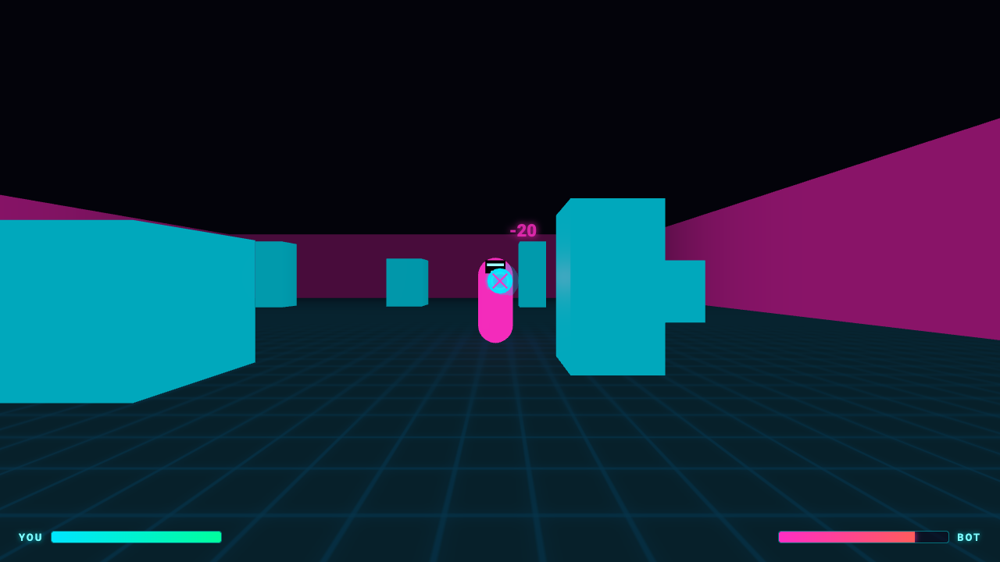

# Neon Arena — 3D FPS




*Русская версия ниже / Russian version below*

## English

A browser-based 3D first-person shooter. Fight 1 to 4 AI-controlled
opponents to the death in a walled sci-fi neon arena. Built with
[Three.js](https://threejs.org/) — a static site with no build step and
no server-side code, running entirely in the browser.

**Features**
- Sci-fi neon arena with cover pillars and glowing walls
- Choose 1–4 aggressive AI opponents (default: 1) from the start or
  end-of-round screen — each chases, takes cover, strafes, and shoots
- **Survival mode**: 4 rounds, +1 enemy each round, optional health
  carry-over between rounds — die and you're back to round 1
- Health bars, tracer-bolt shot visualization, floating damage numbers
- Synthesized sound effects (no external audio files)
- Pause menu (Escape), with a mid-run exit back to normal mode during
  Survival
- Playable on phones/tablets — on-screen joystick, look-drag, and fire/pause
  buttons appear automatically on touch devices
- Optional health pickups scattered around the arena and a camera-shake hit
  effect — both toggleable on the start screen

**Controls (desktop)**

| Key             | Action              |
|-----------------|---------------------|
| ↑ / ↓           | Move forward / back |
| ← / →           | Strafe left / right |
| Mouse           | Look around          |
| Space / LMB     | Fire                |
| Escape          | Pause / resume       |

**Controls (touch)**

| Gesture               | Action        |
|------------------------|---------------|
| Drag — left half       | Move          |
| Drag — right half      | Look around   |
| Tap fire button         | Fire          |
| Tap pause button         | Pause / resume |

### How to run

The game can't be opened directly as a `file://` URL — browsers block ES
module imports that way. You need a local static file server:

1. Download or clone this folder.
2. From inside the folder, start a local server, for example:
   ```bash
   python3 -m http.server 8000
   # or, if you have Node.js:
   npx serve .
   ```
   (VS Code users can also use the "Live Server" extension instead.)
3. Open `http://localhost:8000` (or whatever port your server prints) in
   a browser.

No internet connection is required — Three.js is bundled locally in
`vendor/three/`, so nothing is fetched from a CDN.

---

## Русский

Браузерный 3D-шутер от первого лица. Сражайся насмерть с 1-4
противниками, управляемыми компьютером, на арене в sci-fi неоновом
стиле. Сделано на [Three.js](https://threejs.org/) — статический сайт
без сборки и без серверного кода, всё работает прямо в браузере.

**Возможности**
- Неоновая sci-fi арена с укрытиями и светящимися стенами
- Выбор количества противников от 1 до 4 (по умолчанию — 1) на экране
  старта или в конце раунда — каждый преследует, использует укрытия,
  двигается боком и стреляет
- **Режим "На выживание"**: 4 раунда, +1 враг за раунд, можно
  переносить здоровье между раундами или начинать каждый раунд
  заново — при смерти забег начинается с раунда 1
- Полоски здоровья, визуализация выстрелов (трассеры), всплывающие
  цифры урона
- Синтезированные звуковые эффекты (без внешних аудиофайлов)
- Меню паузы (Escape), с возможностью выйти в обычный режим прямо
  посреди забега "на выживание"
- Играбельно на телефоне/планшете — на сенсорных устройствах
  автоматически появляются джойстик, драг-обзор и кнопки огня/паузы
- Опциональные аптечки на арене и тряска камеры при получении урона —
  оба переключаются на стартовом экране

**Управление (десктоп)**

| Клавиша         | Действие                |
|-----------------|--------------------------|
| ↑ / ↓           | Движение вперёд / назад |
| ← / →           | Стрейф влево / вправо   |
| Мышь            | Обзор                    |
| Space / ЛКМ     | Стрельба                 |
| Escape          | Пауза / продолжить       |

**Управление (сенсорный экран)**

| Жест                    | Действие        |
|--------------------------|-----------------|
| Драг — левая половина    | Движение        |
| Драг — правая половина   | Обзор           |
| Тап по кнопке огня       | Стрельба        |
| Тап по кнопке паузы      | Пауза / продолжить |

### Как запустить

Открыть игру напрямую как `file://` не получится — браузеры блокируют
ES-модули при таком открытии. Нужен локальный статический сервер:

1. Скачай или склонируй эту папку.
2. Находясь внутри папки, запусти локальный сервер, например:
   ```bash
   python3 -m http.server 8000
   # или, если установлен Node.js:
   npx serve .
   ```
   (В VS Code можно вместо этого использовать расширение "Live Server".)
3. Открой в браузере `http://localhost:8000` (или порт, который покажет
   сервер).

Интернет не нужен — Three.js уже лежит локально в `vendor/three/`,
ничего не подгружается с CDN.

---

## License / Лицензия

MIT — see [LICENSE](LICENSE). / MIT — см. [LICENSE](LICENSE).
